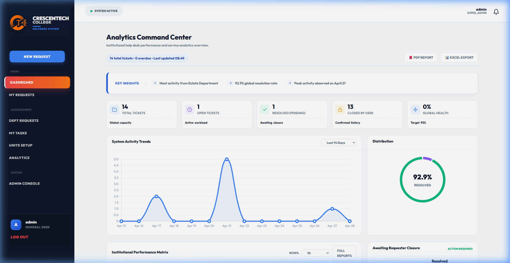

# eTicket – Enterprise Help Desk & Service Request Management System

A professional software portfolio and case study for **eTicket**, a premium Enterprise Help Desk and Service Request Management platform developed for modern institutional service delivery.

## 🚀 Overview
The eTicket System is a high-performance ticketing and reporting intelligence suite designed to modernize institutional communication and ensure absolute compliance with service standards.

### Key Features
- **Analytics Command Center**: High-fidelity administrative cockpit for real-time oversight.
- **Intelligent Routing**: Automated task assignment based on departmental logic.
- **SLA Monitoring**: Continuous tracking of resolution benchmarks with automated closure policies.
- **Institutional Security**: 5-tier Role-Based Access Control (RBAC) and source protection.
- **Board-Ready Reporting**: Automated generation of performance analytics in Excel/PDF formats.

## 🛠️ Technology Stack
- **Backend**: Python 3.11 / Django 5.x
- **Frontend**: Bootstrap 5.3, Vanilla CSS3, Chart.js
- **Database**: PostgreSQL
- **Infrastructure**: Redis, Docker, Linux Server

## 🎨 Design Philosophy
The system follows a **Premium Executive Aesthetic**:
- **Corporate Color Palette**: Navy Blue, Subtle Gold, and Clean Slate.
- **Typography**: Outfit & Inter font families for maximum readability.
- **Responsive Architecture**: Fluid layouts for Desktop, Tablet, and Mobile environments.

## 👨‍💻 Developer Contribution
Built from the ground up, including:
- Full-stack Architecture & Database Design
- Custom Workflow Automation Engine
- UI/UX Design & Implementation
- Security Hardening & RBAC Logic
- Deployment & Maintenance

---
**Developed by [CrescentechSln](https://www.linkedin.com/in/barasabriston/)**
